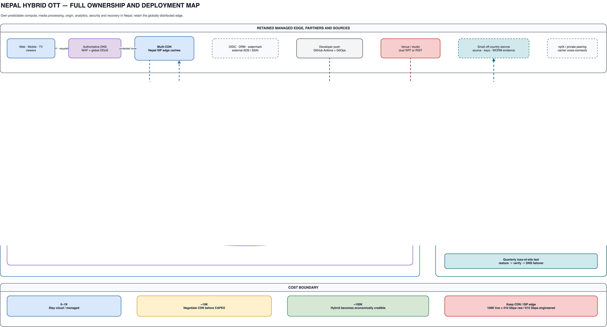

# Nepal hybrid and in-house OTT architecture cost estimate

**Estimate date:** 22 July 2026  
**Currency:** USD and NPR at **NPR 154.62/USD**, Nepal Rastra Bank USD selling rate for 21 July 2026  
**Accuracy:** decision-grade planning estimate, normally ±35–50% until Nepal colocation, transit/CDN, server, tax and support bids are received

## Executive decision

The cost-saving target should be a **Nepal private-cloud origin with managed edge delivery**, not a fully self-delivered OTT network. Move the application platform, databases, search, VOD processing, object origin, analytics, observability, security monitoring, digital-forensic evidence and recovery capacity into two Nepal failure domains. Keep global DNS, WAF/DDoS, CDN/local ISP caches, DRM/watermarking and the external ad decision server managed until their replacement has a measured business case.

- **0–1K viewers:** stay on AWS or use a lean managed Nepal cloud. Hardware, two sites and specialist operations cost more than the cloud bill.
- **Around 10K:** the standard model is nearly break-even. Do not buy hardware solely for savings; first negotiate CloudFront, a multi-CDN, and Nepal ISP cache/peering terms.
- **Around 100K:** hybrid becomes economically credible. The target case saves about **$269K/month including five-year hardware amortization**, provided media delivery is contracted near $0.01/GB.
- **Fully self-delivered video is rejected:** 100K concurrent HD viewers require about **410 Gbps raw** and **615 Gbps engineered** live egress. The direct-transit estimate is already worse than AWS and still excludes a national cache footprint.

## Full target architecture

[Open the editable Draw.io architecture](./drawio/07-nepal-hybrid-on-prem.drawio). The PNG below is generated from the same source.

### Architecture boundary: what moves and what stays managed

| Move to Nepal private cloud | Keep managed/contracted | Reason |
|---|---|---|
| Kubernetes application services, API gateway and GitOps agents | Authoritative public DNS, global WAF and DDoS | The application is predictable compute; edge attack absorption is not. |
| PostgreSQL HA, OpenSearch and NATS JetStream | Primary OIDC provider initially | State can be replicated locally; identity migration adds little early savings. |
| Ceph/MinIO object origin and immutable backup | Multi-CDN plus Nepal ISP caches/peering | Origin storage is economical in-house; last-mile delivery needs distributed capacity. |
| FFmpeg, ffprobe/QC and Shaka/Bento4 VOD pipeline | DRM, forensic watermarking and external ADS | Batch media tools are mature; rights/ad integrations remain specialist contracts. |
| SRT gateway, redundant encoders and live origin | Managed SSAI at first | Contribution/origin is bounded; personalization scale and ad compliance are harder. |
| Parquet/Iceberg lake, Trino/DuckDB, Grafana/Metabase | Small off-country immutable escrow | Analytics is steady compute; national-disaster evidence needs an independent copy. |

### Flow descriptions: what, why and how

1. **Playback/control — What:** authenticate and return playback metadata. **Why:** keep entitlement authoritative without pushing API traffic through the media origin. **How:** viewers enter managed DNS/WAF, API requests reach the Nepal load balancer and Kubernetes services, and media URLs return through the CDN.
2. **VOD — What:** turn uploaded masters into protected, quality-checked ABR packages. **Why:** automation replaces variable managed transcoding while preserving malware and two QC gates. **How:** quarantine → ClamAV/YARA → FFmpeg → technical QC → Shaka/Bento4 → playback QC → Ceph/MinIO → CDN.
3. **Live — What:** ingest and publish redundant adaptive live streams. **Why:** live continuity needs independent input/encoder paths and an origin that can be cached. **How:** dual SRT/RIST contribution → redundant encoder pool → live packager/origin → CDN; catch-up output is written to object storage.
4. **Analytics/recommendation — What:** collect QoE and behavior without turning analytics into transactional truth. **Why:** cheap retained data supports operations and recommendations. **How:** Vector/Fluent Bit → NATS/object lake in Parquet/Iceberg → Trino/DuckDB → Grafana/Metabase and scheduled recommendation jobs.
5. **Security and digital forensics — What:** detect threats and preserve selected evidence. **Why:** analytics retention is not legal chain-of-custody. **How:** Wazuh/Falco/Suricata and application audit events feed a security lake; case exports are hashed, signed and retained in a separate WORM vault for investigators.
6. **Release — What:** deploy immutable application releases. **Why:** keep production changes reviewable and recoverable. **How:** developer push → GitHub Actions → signed image in Harbor plus environment commit in the GitOps repository → Argo CD reconciles Kubernetes.
7. **Recovery — What:** restore service in an independent Nepal failure domain. **Why:** one building, utility feed or fiber corridor is not disaster recovery. **How:** async PostgreSQL, object, registry and backup replication feed the recovery site; DNS failover occurs only after a tested recovery gate. A small encrypted off-country escrow protects against a national event.

## Workload and traffic assumptions

Viewer count means monthly VOD viewers and average concurrent live viewers during the event. The comparison uses the same count for both: 10 VOD hours/viewer/month at 5 Mbps plus 20 live event-hours/month at 4.1 Mbps. It also retains the prior 1,000-hour catalog and 100 new VOD source hours/month.

| Scenario | Usage | Average delivered bitrate | Data per viewer/month | Use |
|---|---|---|---|---|
| VOD light | 2 h/viewer/month | 3 Mbps | 2.64 GB | Use for short-form/low engagement |
| VOD standard | 10 h/viewer/month | 5 Mbps | 21.97 GB | Used in cost comparison |
| VOD heavy | 30 h/viewer/month | 8 Mbps | 105.47 GB | Premium/large-screen sensitivity |
| Live standard | 20 event h/month | 4.1 Mbps | 36.04 GB | Used in cost comparison |
| Live busy | 200 event h/month | 4.1 Mbps | 360.35 GB | 10× standard live volume |

### Workload-profile monthly sensitivity

Each cell is `AWS India-edge / Nepal hybrid`. Platform footprint, catalog and recovery assumptions remain the same; only viewer media volume and scheduled live encoding change.

| Combined profile | Media/viewer/month | 1K AWS / hybrid | 10K AWS / hybrid | 100K AWS / hybrid |
|---|---|---|---|---|
| Light: VOD 2 h @ 3 Mbps + live 20 h @ 1.8 Mbps | 18 GB | $5,960 / $19,761 | $26,562 / $52,335 | $193,482 / $184,222 |
| Standard: VOD 10 h @ 5 Mbps + live 20 h @ 4.1 Mbps | 58 GB | $9,390 / $20,157 | $58,531 / $56,290 | $492,671 / $223,773 |
| Heavy: VOD 30 h @ 8 Mbps + live 200 h @ 4.1 Mbps | 466 GB | $44,019 / $24,235 | $376,091 / $97,071 | $3,524,040 / $631,586 |

### Live egress boundary

| Concurrent viewers | Raw at 4.1 Mbps | With 50% headroom | Practical delivery |
|---|---|---|---|
| 0 | 0.000 Gbps | 0.000 Gbps | Dedicated enterprise links |
| 1 | 0.004 Gbps | 0.006 Gbps | Dedicated enterprise links |
| 100 | 0.410 Gbps | 0.615 Gbps | Dedicated enterprise links |
| 1K | 4.100 Gbps | 6.150 Gbps | Dedicated enterprise links |
| 10K | 41.000 Gbps | 61.500 Gbps | CDN/ISP cache mandatory |
| 100K | 410.000 Gbps | 615.000 Gbps | CDN/ISP cache mandatory |

The in-house origin only needs enough upstream capacity for cache misses, cache fill, APIs and contribution. The CDN/ISP edge must absorb viewer fan-out. Require two physically diverse carriers, BGP, local peering where commercially available, and proof that routes do not share the same cross-border or metro failure domain.

## Monthly cost comparison — standard combined workload

| Viewers | Media/month | AWS India-edge | Nepal hybrid | Full direct delivery | Hybrid vs AWS |
|---|---|---|---|---|---|
| 0 | 0 GB | $2,590 | $12,279 | $15,779 | costs $9,689 more |
| 1 | 58 GB | $2,590 | $12,279 | $15,779 | costs $9,689 more |
| 100 | 5.7 TB | $3,348 | $13,130 | $17,372 | costs $9,781 more |
| 1K | 56.6 TB | $9,390 | $20,157 | $32,527 | costs $10,767 more |
| 10K | 566.5 TB | $58,531 | $56,290 | $132,989 | save $2,241 |
| 100K | 5.53 PB | $492,671 | $223,773 | $862,765 | save $268,898 |

AWS uses the current India CloudFront transfer tiers and a planning uplift of 18% for the US-East platform envelope and 15–20% for media/content services in Mumbai. Nepal hybrid includes five-year hardware amortization, support, power, two failure domains, staffing, retained edge services and CDN at $0.01/GB. Full direct delivery uses an optimistic $1,000 per committed Gbps-month planning proxy plus DDoS/edge operations; it is not a supplier quote and excludes construction of ISP cache nodes.

## Nepal private-cloud monthly breakdown

| Monthly component | 0 | 1 | 100 | 1K | 10K | 100K |
|---|---|---|---|---|---|---|
| Hardware amortization (5 years) | $3,000 | $3,000 | $3,000 | $4,167 | $10,833 | $41,667 |
| Hardware support/spares (8%/year) | $1,200 | $1,200 | $1,200 | $1,667 | $4,333 | $16,667 |
| Power: PUE 1.70 + NEA demand | $279 | $279 | $372 | $743 | $2,322 | $7,432 |
| Colocation, dual carriers and remote hands | $1,500 | $1,500 | $1,800 | $3,000 | $10,000 | $30,000 |
| Incremental SRE/NOC/security staffing | $5,000 | $5,000 | $5,000 | $7,000 | $15,000 | $40,000 |
| Software and vendor support | $800 | $800 | $1,000 | $1,800 | $4,000 | $12,000 |
| **Private-cloud core subtotal** | $11,779 | $11,779 | $12,372 | $18,377 | $46,489 | $147,765 |
| Retained DNS/WAF/DDoS/edge services | $500 | $500 | $700 | $1,200 | $4,000 | $18,000 |
| CDN at $0.01/GB | $0 | $1 | $58 | $580 | $5,801 | $58,008 |
| **Hybrid total** | $12,279 | $12,279 | $13,130 | $20,157 | $56,290 | $223,773 |

Power uses an IT load of 3–80 kW, PUE 1.70, NEA commercial energy at NPR 11.10/kWh and NPR 315/kVA-month demand charge. Facility pricing is a planning allowance for carrier-neutral colocation, dual carriers and remote hands—not a public retail quote. Operations labour is incremental platform/SRE/NOC/security staffing; the product and content teams remain outside this table.

## Hardware sizing and CAPEX

| Viewer tier | General compute | Media/QC | Usable object capacity | Fabric | CAPEX USD | CAPEX NPR |
|---|---|---|---|---|---|---|
| 0 / 1 / 100 | 3 compute | 2 media/QC | ~120 TB | 10/25 GbE | $180,000 | NPR 2.78 crore |
| 1K | 6 compute | 3 media/QC | ~300 TB | 25 GbE | $250,000 | NPR 3.87 crore |
| 10K | 12 compute | 6 media/QC | ~1 PB | 100 GbE | $650,000 | NPR 10.05 crore |
| 100K | 24 compute | 12 media/QC | ~3 PB | 200 GbE | $2,500,000 | NPR 38.66 crore |

| CAPEX category | 0 | 1 | 100 | 1K | 10K | 100K |
|---|---|---|---|---|---|---|
| Compute, GPU/transcode and management nodes | $48,000 | $48,000 | $48,000 | $75,000 | $180,000 | $650,000 |
| Object storage, database and backup media | $42,000 | $42,000 | $42,000 | $65,000 | $180,000 | $700,000 |
| Core network, firewall and load balancers | $28,000 | $28,000 | $28,000 | $35,000 | $90,000 | $300,000 |
| Recovery-site hardware and replication | $25,000 | $25,000 | $25,000 | $35,000 | $100,000 | $450,000 |
| Racks, UPS allocation, cabling and commissioning | $15,000 | $15,000 | $15,000 | $18,000 | $40,000 | $150,000 |
| Landed-cost, tax, spares and contingency allowance | $22,000 | $22,000 | $22,000 | $22,000 | $60,000 | $250,000 |
| **Total CAPEX** | **$180,000** | **$180,000** | **$180,000** | **$250,000** | **$650,000** | **$2,500,000** |

The 0/1/100 columns intentionally share the same production footprint: HA and recovery have minimum sizes. Storage is usable capacity after protection and operational reserve, not raw disk. The landed-cost allowance includes a planning buffer for freight, spares, VAT/customs treatment and commissioning; procurement must replace it with Nepal tax advice and vendor quotations. Nepal's standard VAT rate is 13%, but recoverability and customs classification are entity- and equipment-specific.

## CDN contract sensitivity

| Delivered-media rate | 1K hybrid/month | 10K hybrid/month | 100K hybrid/month |
|---|---|---|---|
| Strong local/committed rate: $0.005/GB | $19,867 | $53,390 | $194,769 |
| Target case: $0.010/GB | $20,157 | $56,290 | $223,773 |
| Weak contract: $0.020/GB | $20,737 | $62,091 | $281,781 |

At 10K, CDN price alone can reverse the decision. At 100K, even the weak $0.02/GB case remains below AWS pay-as-you-go in this workload, but a multi-CDN, committed CloudFront plan or ISP cache agreement may narrow the gap without owning servers. Require bids to separate local Nepal delivery, India/APAC delivery, cache-fill traffic, requests, logs, WAF, DDoS and support.

## Migration development cost

Formula from the cost-estimator skill: `base hours × $55/hour blended loaded rate × 1.30 integration complexity × 1.30 risk buffer` = **$92.95/effective base hour**. The blend assumes Nepal delivery staff plus scarce media, network and security specialists.

| Migration phase | Base hours | Cost USD | Cost NPR |
|---|---|---|---|
| Discovery, traffic evidence, site/RFP and target design | 700 | $65,065 | NPR 1.01 crore |
| Dual-site network, Kubernetes, registry and object-storage foundation | 1,500 | $139,425 | NPR 2.16 crore |
| Identity, APIs, PostgreSQL, search and event-state migration | 1,200 | $111,540 | NPR 1.72 crore |
| VOD scan, FFmpeg, QC, packaging and origin replacement | 1,200 | $111,540 | NPR 1.72 crore |
| Live contribution, redundant encoders, origin and CDN integration | 1,400 | $130,130 | NPR 2.01 crore |
| Analytics lake, dashboards, recommendations and ad integration | 800 | $74,360 | NPR 1.15 crore |
| Security monitoring, WORM evidence and forensic procedures | 600 | $55,770 | NPR 86.23 lakh |
| DR drills, performance tests, parallel run and cutover | 600 | $55,770 | NPR 86.23 lakh |
| **Hybrid total** | **8,000** | **$743,600** | **NPR 11.50 crore** |
| Full self-delivery extension | 4,600 | $427,570 | NPR 6.61 crore |
| **Full self-delivery total** | **12,600** | **$1,171,170** | **NPR 18.11 crore** |

This is incremental migration engineering; it does not repeat the earlier product-build estimate. Hybrid is approximately 9–12 months with a focused 8–10 person migration team while the AWS service remains live. Full direct delivery is 14–18 months and adds cache control, traffic engineering, DDoS operations, 24×7 NOC integration and more device/network testing.

## Break-even and payback

| Tier | CAPEX + hybrid migration | AWS/month | Hybrid cash OPEX/month | Simple payback | Decision |
|---|---|---|---|---|---|
| 1K | $993,600 | $9,390 | $15,990 | No payback | Stay cloud/managed |
| 10K | $1,393,600 | $58,531 | $45,457 | 107 months | Proceed only after contracted traffic |
| 100K | $3,243,600 | $492,671 | $182,106 | 10 months | Economically plausible |

Payback compares AWS monthly spend with hybrid **cash** operating cost, excluding the non-cash amortization already represented by initial CAPEX. It assumes the standard workload persists and the target CDN contract is achieved. At 10K, an approximately nine-year simple payback is too slow for fast-changing media hardware. At 100K, the mathematical payback is about 10–11 months; use a 12–24 month investment gate after traffic, supplier and migration contingencies rather than treating the point estimate as a promise.

## Phased migration plan and stop/go gates

1. **Measure before buying (4–6 weeks):** export 90 days of actual viewer-hours, country mix, bitrates, CDN cache hit, origin bytes, request counts, live peaks and AWS bills. Stop if sustained traffic is below the 10K band.
2. **Commercial-first savings (4–8 weeks):** test CloudFront flat/committed pricing, bitrate/QVBR reduction, local ISP caches and a second CDN. Stop the hardware programme if these remove most of the gap.
3. **Nepal foundation (8–12 weeks):** contract two carrier-neutral failure domains, diverse carriers/power, 25/100GbE fabric, Kubernetes, Harbor, GitOps, PostgreSQL and object storage. No production cutover yet.
4. **Low-risk workloads (8–12 weeks):** move analytics, recommendations, observability, CI runners and offline VOD transcoding. Compare real unit cost and failure rate with AWS.
5. **Origin and state (10–14 weeks):** dual-write/replicate catalog, entitlement projections, search and VOD packages; shadow APIs and playback QC; retain AWS rollback.
6. **Live and edge integration (8–12 weeks):** run parallel encoders/origins, CDN failover, manifest/DRM/SSAI tests and 2× expected-load events.
7. **Recovery and forensic acceptance (4–6 weeks):** complete loss-of-site drills, evidence chain-of-custody validation, backup restoration and DNS failover before reducing AWS to escrow/rollback.

## Procurement and risk controls

- Demand written 10G/100G quotes from at least two carriers and verify physical path diversity, upstream countries, BGP communities, DDoS limits, repair SLA and cross-connect fees.
- Use a carrier-neutral facility. Nepal providers publicly describe Tier-3/carrier-neutral options, but availability, certifications and prices must be independently verified during the RFP.
- Put the recovery site in a genuinely independent seismic, flood, utility and metro-fiber failure domain; city names alone do not prove independence.
- Keep source media, encryption recovery material, Git repositories and selected immutable evidence in a small off-country escrow. This is deliberate risk reduction, not a return to full cloud hosting.
- Do not rebuild DRM, watermarking, ad decisioning, CDN control or a recommendation platform until measured vendor cost exceeds the full internal support burden.
- Budget hardware refresh at year 4–5, disk growth, failed-drive inventory, security subscriptions, penetration testing, external audit and 24×7 escalation coverage.

## Sources and pricing basis

- [Nepal Rastra Bank foreign exchange rates](https://www.nrb.org.np/forex/) — USD selling rate used for NPR conversion.
- [Nepal Electricity Authority FY 2024/25 tariff publication](https://pmitd.nea.org.np/uploads/shares/annual_report/89899842.pdf) — commercial time-of-day energy and demand charges used as the power basis.
- [Nepal Inland Revenue Department VAT FAQ](https://ird.gov.np/faq/?gid=96) — standard VAT rate of 13%.
- [Nepal Telecommunications Authority approved ISP tariff list](https://nta.gov.np/uploads/contents/Updated%20Approved%20Tariff%20List%20of%20Internet%20Service%20Provicers.pdf) — confirms regulated provider tariffs but does not substitute for high-capacity wholesale bids.
- [Internet Exchange Nepal](https://www.npix.net.np/) — local peering context; commercial port/cross-connect terms require confirmation.
- [Data World Nepal](https://dataworld.com.np/) and [DataHub Nepal](https://datahub.com.np/services/data-center/our-data-centers/) — examples of publicly described carrier-neutral/Tier-3 Nepal facilities; neither is endorsed or price-quoted here.
- [Amazon CloudFront pay-as-you-go pricing](https://aws.amazon.com/cloudfront/pricing/pay-as-you-go/) and [CloudFront plans](https://aws.amazon.com/cloudfront/pricing/) — India delivery tiers and alternative commitment model.
- [AWS Elemental MediaConvert](https://aws.amazon.com/mediaconvert/pricing/), [MediaPackage](https://aws.amazon.com/mediapackage/pricing/), [MediaTailor](https://aws.amazon.com/mediatailor/pricing/) and [AWS live-streaming examples](https://docs.aws.amazon.com/solutions/latest/live-streaming-on-aws/plan-your-deployment.html) — retained AWS comparison assumptions.

## Inputs required for a procurement-grade estimate

Provide 90-day viewer geography, VOD viewer-hours, live concurrency percentiles, event calendar, bitrate/device distribution, CDN logs/cache hit, title and source-size inventory, retention, ad load, DRM/watermark prices, current staff capability, RTO/RPO, facility candidates and signed 10G/100G/CDN quotes. Those inputs should reduce uncertainty from ±35–50% to approximately ±15%, followed by a two-event pilot before final CAPEX approval.
