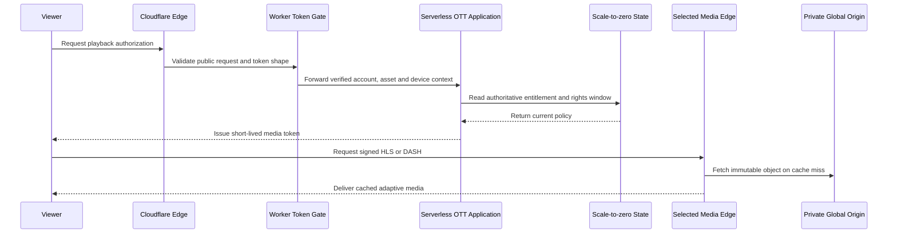
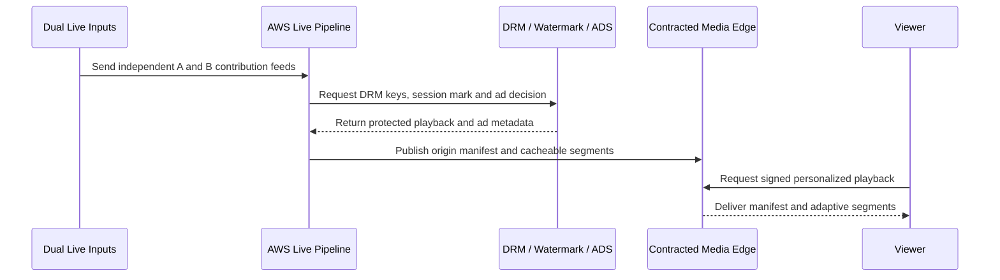

# Cost-Effective Nepal Hybrid OTT Architecture

Use a scale-to-zero AWS control plane, low-cost global origin, replaceable media delivery, and a quoted Nepal origin/cache tier only after sustained local traffic proves the saving.

[Open the interactive diagram](./09-cloudflare-hybrid-architecture.html) · [Download Draw.io](./drawio/09-cloudflare-hybrid-architecture.drawio) · [Back to suite](./index.html)

## Architecture decisions

- Cloudflare protects DNS, the public web application, and APIs; production video uses a separately priced media-delivery route.
- The global origin is selected by landed cost and capability: R2, S3, or Bunny Storage. Objects remain private, immutable, versioned, and independently recoverable.
- CloudFront Free/Pro is the launch baseline; CloudFront Premium and Bunny Volume are measured at the 1K–10K tier; 100K viewers require enterprise bids.
- A Nepal tier begins as managed IaaS, object origin, or cache capacity inside a quoted provider facility. Owned hardware is added only when its fully burdened payback is under 24–36 months.
- Premium live and premium VOD keep proven AWS processing plus contracted DRM, watermarking, and SSAI until a replacement passes device, rights, failover, and evidence acceptance.
- Security telemetry and selected case evidence remain different products: Security Lake supports correlation, while a separate S3 Object Lock vault preserves evidence and recovery copies.

## Add only when

- Activate the Nepal origin/cache tier only after 90 days of traffic shows sustained local volume, the quoted total cost beats the CDN/origin alternative, and a two-event pilot passes QoE and failover tests.
- Buy servers only after managed Nepal cloud or colocation quotes show a 24–36 month fully burdened payback including staff, power, support, spares, tax, transit, and recovery.
- Move premium live processing only after DRM, watermarking, SSAI, 4K/codec, redundant-input, and TV-device acceptance tests pass.
- Add containers or EKS only when measured runtime, steady utilization, deployment count, or team isolation makes Lambda materially worse.
- Add a second CDN only when measured availability, Nepal routing, or commercial leverage justifies the operational cost.

## Components

| Component | Technology | Scope |
|---|---|---|
| Viewer applications | Web · mobile · TV | HTTPS · HLS · DASH |
| Content operations | CMS · mezzanine upload | VOD source |
| Live contribution | Dual SRT / RIST feeds | A/B inputs |
| Cloudflare public edge | DNS · WAF · DDoS · static app | Free/Pro scope |
| Token validation | Cloudflare Workers | entitlement token |
| Protected AWS API | API Gateway · private integration | control plane |
| OTT application | Lambda → containers by trigger | catalog · rights · playback |
| Authoritative state | Aurora Serverless v2 | scale to zero · rights · outbox |
| VOD processing | MediaConvert / FFmpeg · QC | ABR · package · protect |
| Low-cost global origin | R2 · S3 · Bunny Storage | immutable VOD · catch-up |
| Premium live pipeline | MediaLive · MediaPackage · MediaTailor | dual input · DRM · SSAI |
| Rights and ad partners | DRM · watermark · external ADS | contracted services |
| Nepal origin / cache tier | Managed IaaS or colocation | DataHub · Ncell · DataWorld RFP |
| Replaceable media delivery | CloudFront flat · Bunny · enterprise CDN | signed HLS · DASH |
| AWS recovery + evidence | S3 versioning · Object Lock | separate buckets/accounts |
| Security operations | Security Lake · case workflow | correlation · investigation |

## 1. Use the application and APIs

- **What:** Serve the OTT application and an authenticated catalog or account request.
- **Why:** The inexpensive edge can absorb attacks and cache static assets without moving business truth or authorization into the CDN.
- **How:** Cloudflare terminates the public request, API Gateway enforces the API contract, Lambda runs business policy at idle and launch, and scale-to-zero state remains authoritative. Containers are added only after a measured runtime or load trigger.

1. **Enter the Cloudflare edge:** Cloudflare serves the static application and applies DNS, TLS, WAF, rate, and DDoS policy.
2. **Forward the protected API request:** Only validated dynamic requests continue to the AWS API boundary.
3. **Call the private application:** API Gateway validates the route and JWT before forwarding verified claims through the private integration.
4. **Read current business state:** The application asks Aurora for current account, catalog, subscription, and rights data.
5. **Return constrained results:** Aurora returns only the state required for this request.
6. **Return the application response:** The viewer receives policy-filtered data; video bytes do not pass through the application compute tier.

## 2. Play VOD from the low-cost origin

- **What:** Authorize and deliver immutable VOD or catch-up content from the selected private object origin.
- **Why:** Low-cost object storage and edge caching reduce origin cost, but public buckets or cacheable bearer tokens would expose protected media.
- **How:** A Worker validates the public request, the serverless AWS application and authoritative state authorize the session, and the viewer uses a short-lived token against the selected media edge and private origin.

1. **Request playback authorization:** The viewer asks for one asset using an authenticated application session.
2. **Validate the edge request:** The Worker checks token shape, route, replay controls, and origin authentication before forwarding.
3. **Forward verified playback context:** Only normalized account, asset, device, region, and request identifiers reach the application.
4. **Evaluate entitlement and rights:** Aurora supplies subscription, territory, concurrency, rights window, and presentation metadata.
5. **Return the approved presentation:** The result identifies the immutable global-origin presentation only when every policy check passes.
6. **Issue short-lived media access:** The application returns a narrowly scoped token and media URL without exposing origin credentials.
7. **Request signed adaptive media:** The media request uses the selected priced delivery service rather than assuming an application CDN includes unlimited video.
8. **Fetch immutable objects on miss:** The edge fetches a versioned manifest or segment only after token and cache-key policy succeeds.
9. **Deliver cached media:** The viewer receives adaptive media from the edge; the object origin is not directly public to the player.

## 3. Publish VOD to the low-cost path

- **What:** Create technically valid, protected, immutable VOD packages and publish them to the selected global origin.
- **Why:** Cheap storage does not replace malware checks, source integrity, technical QC, playback QC, rights controls, or rollback.
- **How:** The processing pipeline creates ABR outputs, contracted rights services provide keys or marks when needed, and only passing versioned packages are copied to the private origin and tested through the real edge.

1. **Ingest and process the source:** The workflow validates the object version, malware result, source fingerprint, and job id before transcoding.
2. **Request protection material:** Premium packages request keys and forensic policy; non-premium packages explicitly record that protection is not required.
3. **Return keys and policy:** The processing job receives scoped protection material without persisting reusable plaintext keys.
4. **Publish the QC-passed version:** Technical QC and playback QC must both pass before the immutable package prefix becomes active.
5. **Run a real edge playback check:** A synthetic client fetches the manifest, keys, captions, and sample segments through the production token and cache route.
6. **Expose the approved presentation:** The application activates version 4 only after the edge playback check succeeds; rollback keeps version 3 intact.

## 4. Deliver premium live through the selected CDN

- **What:** Publish a redundant premium live event with DRM, watermarking, SSAI, and contracted edge delivery.
- **Why:** The largest savings come from delivery, while the hardest correctness requirements remain in contribution, encoding, packaging, rights, ads, and failover.
- **How:** Dual live inputs feed the AWS managed live pipeline; partner services return rights and ad decisions; the selected media edge distributes the resulting manifests and cacheable segments.

1. **Ingest independent live feeds:** Two contribution and input paths enter redundant encoders so a single feed or encoder failure does not end the event.
2. **Request DRM, watermark, and ads:** MediaPackage and MediaTailor request protection and ad decisions with privacy-safe session and opportunity context.
3. **Return protected playback policy:** Partner responses supply scoped keys, watermark policy, eligible creative, and tracking metadata.
4. **Publish the premium origin:** The AWS live path exposes an authenticated, redundant origin manifest and cacheable content/ad segments to the contracted media edge.
5. **Request signed live playback:** The viewer presents short-lived access; the edge applies geography, token, cache, and attack controls.
6. **Deliver live content and ads:** The player receives personalized manifests and adaptive content/ad segments without sending bulk video through the application compute tier.

## 5. Activate the Nepal origin and cache tier

- **What:** Replicate approved media into a Nepal managed origin/cache tier and serve eligible Nepal sessions locally with global failback.
- **Why:** Keeping popular bytes inside Nepal can reduce international transfer and startup time, but only if facility, carrier, operations, and recovery costs are lower than the CDN alternative.
- **How:** Approved immutable versions replicate from the global origin; the selected CDN or traffic policy uses the Nepal route only while health, token, rights, and QoE gates pass.

1. **Replicate approved immutable packages:** Only active, QC-passed package versions replicate to the Nepal tier; deletion and overwrite are not used as publication mechanisms.
2. **Record the Nepal inventory digest:** The site exports object inventory, configuration, provider, and deployment state so drift and recovery remain measurable.
3. **Request signed Nepal playback:** The viewer uses the same short-lived token and cache key regardless of which healthy delivery route is selected.
4. **Use the healthy Nepal route:** The media edge fetches locally only when entitlement scope, provider health, object version, and geography are eligible.
5. **Return the verified local object:** The Nepal tier returns the same immutable representation; a miss or health failure falls back to the global origin.
6. **Deliver locally cached media:** The viewer receives the selected representation while QoE, cache hit, route, bytes, and cost remain observable.

## 6. Preserve evidence and recovery copies

- **What:** Correlate delivery activity, preserve selected case evidence, and restore media after a destructive, provider, or regional event.
- **Why:** A lower-cost route is acceptable only when the service can investigate abuse and recover without trusting one provider or one mutable log store.
- **How:** Cloudflare, CDN, Nepal provider, AWS, and application records enter the security workflow; selected case material and independent recovery copies are retained in AWS; restore is integrity- and playback-gated.

1. **Export edge security records:** WAF, request, token, configuration, and administrator events are exported with UTC time and stable request identifiers.
2. **Export media delivery records:** Cache result, origin status, token outcome, bytes, asset, session, and edge location support QoE, fraud, and incident reconstruction.
3. **Preserve application and recovery state:** Application decisions, GitOps revisions, global and Nepal inventories, configuration, and independent media copies enter separate governed prefixes.
4. **Open a verified case or recovery run:** Security operations correlate working data and promote only material originals, versions, timestamps, identities, and hashes into Object Lock.
5. **Restore an approved immutable version:** After integrity, rights, token, and playback tests pass, the runbook restores a new global-origin versioned prefix and activates it atomically.

## Deployment phases

1. **Idle and launch:** Cloudflare protects the application; AWS HTTP API, Lambda, queues, and scale-to-zero state run the control plane; CloudFront Free/Pro delivers media from a private low-cost origin.
2. **Around 1K viewers:** A/B test CloudFront Premium against Bunny Volume using the same immutable objects, signed-token policy, and Nepal viewer cohort.
3. **Around 10K viewers:** negotiate CDN commits and request managed Nepal object/cache/IaaS quotes. Pilot one non-premium catalog partition before buying hardware.
4. **Around 100K viewers:** run an RFP across global CDN providers, Nepal facilities, carriers, and ISP caches. Add Nepal capacity only where measured cost and QoE beat the global path.
5. **Private infrastructure last:** use owned colocated servers only after a 24–36 month payback, independent recovery site, trained on-call team, and exit plan are approved.

## Control plane and static VOD sequence



## Premium live sequence



## Nepal scale-out sequence

```mermaid
sequenceDiagram
    participant G as Global Object Origin
    participant N as Nepal Managed Origin / Cache
    participant C as Media Steering / CDN
    participant V as Nepal Viewer
    G->>N: Replicate approved immutable package versions
    N-->>G: Return inventory digest and replication status
    V->>C: Request signed HLS or DASH
    C->>N: Fetch from Nepal route when healthy and eligible
    N-->>C: Return locally served manifest or segment
    C-->>V: Deliver media; fail back globally on health failure
```

## Planning cost snapshot

| Published media meter (standard workload) | 10K viewers/month | 100K viewers/month |
|---|---:|---:|
| AWS CloudFront flat-rate delivery plan | $10K | Custom quote |
| Bunny Volume CDN delivery | ~$2.82K | Custom quote above 2 PB |
| Cloudflare Stream delivery + 1,000-hour 1080p catalog | ~$18.3K | ~$180.3K |
| R2 origin storage + estimated reads for ~6 TB packaged VOD | ~$157 | ~$788 |

These are comparable published meters, not complete production quotes. CloudFront and Bunny rows are delivery only; R2 is an origin meter, not a CDN authorization. Every row excludes some combination of control-plane compute, live processing, DRM, SSAI, forensic watermarking, support, logs, taxes, and commitments. See the [cost-optimized architecture by scale](./10-cost-optimized-architecture-by-scale.md) for assumptions and gates.

## Nepal data-center RFP shortlist

| Candidate | Publicly described fit | Verify before selection |
|---|---|---|
| DataHub | Carrier-neutral facilities in Kathmandu and Butwal; colocation, cloud, object storage, DR, and NPIX proximity | Current DoIT status, exact certification scope, independent paths, power allocation, 10/100G price, SLA credits, remote hands |
| Ncell Business | Nakkhu Rated-3 facility, colocation and cloud; provider states DR sites in Pokhara and Hetauda and DoIT enlistment | Carrier neutrality, cross-connect choices, workload pricing, egress, DDoS, cloud API, backup portability |
| DataWorld | Matatirtha purpose-built carrier-neutral facility; published ~3.5 MW and ~510-rack design | Operational history, completed certifications, service availability, second failure domain, carrier and remote-hands quotes |

No candidate publishes enough price and contract detail to declare a winner. Send the same workload and SLA sheet to all three; include NPIX/direct peering, two physically diverse carriers, metered power, cross-connects, remote hands, DDoS, backups, tax, and exit/export.

## Failure and security behavior

- A Worker or entitlement outage fails closed for protected assets; previously cached objects are not made public.
- Global-origin object keys are immutable and versioned. Restore uses the independent AWS recovery copy only after integrity and playback checks pass.
- Premium live keeps dual contribution inputs and AWS-origin redundancy; the selected CDN is the delivery layer, not the sole live source.
- Cloudflare, CDN, Nepal provider, AWS, DRM, ad, and application records share UTC timestamps plus session, request, asset, device, and deployment identifiers.
- Investigators work from verified copies. Selected source records and hashes are promoted to the separate Object Lock evidence vault.

## Commercial and technical gates

- Written approval for the expected video workload and monthly delivery volume.
- SLA and support coverage for Nepal and the required viewer geographies.
- DoIT registration/enlistment and independently verified facility certification appropriate to the contracted service.
- Two physically independent sites, carriers, fiber paths, power systems, and failure domains; marketing city names are not proof.
- Proven Widevine, FairPlay, PlayReady, forensic watermarking, SSAI, codec, caption, and TV-device behavior where required.
- Exportable request, security, cache, token, and delivery logs with agreed retention.
- Tested origin failover, cache purge, key rotation, incident evidence collection, and vendor exit procedure.

## Pricing and provider references

- [Cloudflare video delivery policy](https://developers.cloudflare.com/fundamentals/reference/policies-compliances/delivering-videos-with-cloudflare/)
- [Cloudflare Stream pricing](https://developers.cloudflare.com/stream/pricing/)
- [Cloudflare R2 pricing](https://developers.cloudflare.com/r2/pricing/)
- [AWS CloudFront flat-rate plans](https://docs.aws.amazon.com/AmazonCloudFront/latest/DeveloperGuide/flat-rate-pricing-plan.html)
- [Bunny CDN pricing](https://bunny.net/pricing/cdn/)
- [DataHub data centers](https://datahub.com.np/services/data-center/our-data-centers/)
- [Ncell data-center certification and enlistment](https://www.ncell.com.np/en/about/media-room/press-release/ncell-data-centre-receives-ansitia-942-c-rated-3-certification)
- [DataWorld facilities](https://dataworld.com.np/)
- [Internet Exchange Nepal](https://www.npix.net.np/about)

## Usage

Choose a scenario tab, then use **Next**, **Previous**, or **Play**. Click a node to jump to its first step. Drag nodes to refine the layout; press **R** to reset, **F** for fullscreen, and **T** to switch theme.
