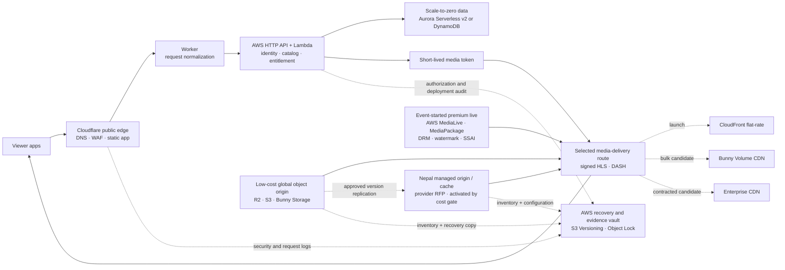

# Cost-Optimized OTT Architecture by Scale

This estimate chooses a different deployment shape at each demand level. The cost-effective answer is not “all AWS,” “all Cloudflare,” or “move everything in-house.” It is a small serverless control plane, a replaceable media edge, and premium media services that run only when a channel or asset requires them.

All amounts are planning estimates in USD per month before tax. They are not vendor quotes.

## Executive recommendation

- **At idle and launch:** use Cloudflare for DNS, WAF, static assets, and a small Worker; use AWS HTTP API, Lambda, queues, object events, and a database that can scale to zero. Do not operate EKS, OpenSearch, Kafka/MSK, or an always-on live encoder.
- **For VOD origin:** begin with R2 or Bunny Storage using immutable versioned object keys. Keep an independent recovery copy and an evidence vault in a separate AWS account or failure domain.
- **For delivery at 0–100 viewers:** benchmark an AWS CloudFront flat-rate Free or Pro plan. The published Pro plan is $15/month and includes up to 50 TB and 10 million requests for one distribution, which is difficult to beat at this tier.
- **At roughly 1K–10K viewers:** pilot Bunny Volume CDN against CloudFront flat-rate plans. Bunny has the cheaper published delivery meter; CloudFront includes more security, DNS, logs, and AWS integration. Select by measured Nepal QoE and total landed cost, not the per-GB rate alone.
- **For premium live, DRM, SSAI, and forensic watermarking:** retain the proven AWS or contracted media path until a replacement passes device, rights, failover, security, and evidence tests.
- **At 100K viewers:** issue a multi-vendor RFP. Compare CloudFront custom, Bunny custom, Cloudflare Enterprise Stream Delivery, Nepal ISP/private-cache capacity, and managed Nepal data-center capacity. Rent managed capacity before buying servers.

## Target architecture

The edge is intentionally replaceable. Application authorization happens before the player receives a narrowly scoped media token; video bytes never pass through Lambda or EKS.

## Standard comparison workload

The table below uses the same standard scenario as the earlier estimates:

- 10 VOD hours per viewer per month at an average 5 Mbps.
- 20 live hours per viewer per month at an average 4.1 Mbps.
- Approximately **58 GB**, **1,800 delivered minutes**, and **19,500 HLS/DASH requests** per viewer per month.
- A 1,000-hour 1080p packaged VOD catalog: approximately **60,000 stored minutes** or **6 TB**.
- Encoding, premium live processing, DRM, SSAI, watermarking, support, logs, taxes, and application compute are separated from the delivery comparison.

| Monthly viewers | Approx. delivery | Segment requests | Delivered minutes |
|---:|---:|---:|---:|
| 0 | 0 | 0 | 0 |
| 1 | 58 GB | 19.5K | 1.8K |
| 100 | 5.8 TB | 1.95M | 180K |
| 1K | 58 TB | 19.5M | 1.8M |
| 10K | 580 TB | 195M | 18M |
| 100K | 5.8 PB | 1.95B | 180M |

## Published media-meter comparison

These figures are deliberately separated from the application/control plane. “Quote” means the workload exceeds a published retail tier or should be commercially negotiated.

| Media option | 0 | 1 viewer | 100 viewers | 1K viewers | 10K viewers | 100K viewers |
|---|---:|---:|---:|---:|---:|---:|
| **CloudFront flat-rate delivery plan** | $0 Free | $0 Free | $15 Pro | $1,450 Premium 75 TB | $10,000 Premium 600 TB | Quote |
| **Bunny Volume CDN delivery** | $1 minimum | $1 minimum | ~$29 | ~$290 | ~$2,820 | Quote above 2 PB |
| **Cloudflare Stream: delivery + 60K stored minutes** | ~$300 | ~$302 | ~$480 | ~$2,100 | ~$18,300 | ~$180,300 |
| **Mux 1080p: delivery + 60K stored minutes** | ~$180 | ~$180 | ~$260 | ~$1,880 | ~$18,080 | ~$180,080 |
| **R2 origin meter: 6 TB + estimated Class B reads** | ~$90 | ~$90 | ~$90 | ~$93 | ~$157 | ~$788 |

### What the table means

- **CloudFront flat-rate plans:** Free includes 100 GB and 1 million requests; Pro is $15 for 50 TB and 10 million requests; configurable Premium reaches $10,000 for 600 TB and 6 billion requests. A workload that repeatedly exceeds the plan can have edge performance adjusted, so the design must move to the next tier before sustained overage. A separate application distribution may need its own plan.
- **Bunny Volume CDN:** published delivery is $0.005/GB through 500 TB, $0.004/GB from 500 TB to 1 PB, and $0.002/GB from 1 PB to 2 PB, with a $1 monthly minimum and no request fee. It uses a smaller volume network, so Nepal routing and cache-hit performance must be tested.
- **Cloudflare Stream:** $5 per 1,000 stored minutes and $1 per 1,000 delivered minutes; encoding and ingress are included. It is operationally simple, but at this usage pattern its delivery meter is not the cheapest bulk option.
- **Mux:** the estimate uses 1080p basic-quality storage at $0.003/minute and delivery at $0.001/minute after the first 100,000 monthly delivery minutes. Custom domains, DRM, DRM playback licenses, premium encoding, live processing, and support are additional.
- **R2:** storage is $0.015/GB-month with free egress, but R2 alone is not a production video-delivery authorization. The estimate adds Class B reads above the free 10 million requests at $0.36/million. Cloudflare’s policy directs video workloads to Stream or an Enterprise arrangement.

## Origin-storage choices

| Origin option for ~6 TB | Published storage meter | Transfer to paired CDN | Best fit | Important limitation |
|---|---:|---:|---|---|
| Cloudflare R2 Standard | ~$90/month | No R2 egress fee | Multi-CDN or Cloudflare contract pilot | Video-delivery terms, token path, logging, purge, and custom-domain behavior must be approved and tested |
| Bunny Storage HDD, one region | ~$60/month | Free to Bunny CDN | Lowest simple Bunny origin | One region is not a recovery strategy; add a second copy/failure domain |
| Amazon S3 Standard | roughly $138/month before request cost or plan credits | AWS-integrated | Premium media and recovery | More expensive raw storage, but mature policy, eventing, Object Lock, and AWS media integration |
| Managed Stream catalog | Cloudflare ~$300; Mux ~$180 | Included in delivery product’s model | Small team that values managed encoding/player workflow | Usage-based delivery becomes expensive at large scale; capability fit still requires validation |

## Nepal data-center deployment choice

The cheapest Nepal option is normally **managed IaaS/object/cache capacity first**, then colocation, then owned facilities. Building a data center is not part of this architecture.

| Model | Up-front cost | Operational burden | Use when | Decision |
|---|---:|---:|---|---|
| Nepal managed cloud/IaaS | Low | Low–medium | Pilot origin, cache, batch processing, or data-residency workload | **First Nepal step** |
| Colocated owned servers | Medium–high | High | Stable utilization and a fully burdened 24–36 month payback are proven | Add later |
| Company-operated data-center room | Very high | Very high | Data-center operations are themselves a business capability | Reject for this OTT project |
| Global cloud only | Low | Low | Idle through moderate scale or uncertain demand | Default until Nepal quotes win |

### Nepal provider RFP shortlist

Public provider pages do not disclose enough workload pricing, carrier charges, or contractual detail to name a winner. Send the same bill of materials and traffic matrix to each candidate.

| Candidate | Publicly described capability | Procurement checks |
|---|---|---|
| [DataHub](https://datahub.com.np/services/data-center/our-data-centers/) | Carrier-neutral Kathmandu and Butwal facilities; colocation, public/private cloud, object storage and DR services | Current DoIT status, certification scope, site independence, metered power, carrier/cross-connect price, NPIX access, SLA credits and remote hands |
| [Ncell Business](https://www.ncell.com.np/en/business/fixed/data-center-co-location) | Nakkhu Rated-3 data center, colocation and cloud; provider states DR sites in Pokhara and Hetauda and DoIT enlistment | Carrier neutrality, cloud API and portability, egress, DDoS, backup, cross-connect choices, service-specific SLA and price |
| [DataWorld](https://dataworld.com.np/) | Matatirtha purpose-built carrier-neutral facility; published design describes approximately 3.5 MW and 510 racks | Operational track record, completed certifications, available services, second failure domain, carriers, remote hands and commercial terms |

[Internet Exchange Nepal](https://www.npix.net.np/about) reports 28 members at two locations and says most local traffic between Nepalese ISPs passes through its facilities. NPIX membership or proximity helps only when the selected carriers and ISPs agree to exchange the required routes and capacity; it does not replace a CDN or DDoS service.

### Mandatory quote sheet

Require monthly and one-time prices for vCPU/RAM or rack units, committed and burst power, two physically diverse 10/100G carriers, cross-connects, local and international transfer, NPIX/direct peering, DDoS, public IP/ASN/BGP, object storage and requests, backups, remote hands, spare storage, tax, support, SLA credits, term, and data export. Reject a proposal that bundles these into one unmeasurable figure.

## Control-plane cost envelope

This is an architecture envelope rather than a vendor quote. It excludes the media table above and depends heavily on log retention, support, database size, team traffic, and security controls.

| Scale | Recommended application shape | Planning envelope/month | What remains off |
|---|---|---:|---|
| Idle / pre-launch | Static app, Workers $5 paid tier if required, HTTP API, Lambda, SQS/EventBridge, scale-to-zero Aurora or DynamoDB | **~$50–$250** | EKS, OpenSearch, MSK, always-on encoders, recommendation training |
| 1–100 viewers | Same serverless shape; scheduled batch jobs; event-started VOD jobs | **~$100–$500** | Kubernetes and dedicated streaming data plane |
| Around 1K | Serverless APIs plus one small scheduled/container worker only where runtime limits require it | **~$300–$1,500** | EKS unless deployment count, runtime, or team isolation proves the need |
| Around 10K | Reserved serverless capacity or small Graviton container service; managed observability with retention budgets | **~$2K–$8K** | Multi-region active/active and Kafka unless SLO/data evidence requires them |
| Around 100K | Negotiated compute, database, support, logging, and multi-CDN contracts; EKS may now be justified | **~$15K–$40K+** | No speculative service; each large fixed platform must have a measured owner and load case |

The current EKS-first platform has a fixed control-plane charge before worker nodes and operational tooling. AWS documents $0.10 per cluster-hour under standard support, about $73/month per cluster, plus every node and add-on. Lambda includes 1 million requests and 400,000 GB-seconds monthly at no charge, and HTTP API request pricing starts around $1 per million in its first tier. That is why serverless is the better idle posture.

## Phase-by-phase migration

### Phase 0 — Idle and development

**What:** run a production-shaped but scale-to-zero control plane; keep media test data small.

**Why:** the largest avoidable idle costs are always-on clusters, databases, search, brokers, and live encoders—not DNS or a few API calls.

**How:** deploy the static UI at the edge; use Workers only for lightweight boundary logic; use AWS-managed identity, HTTP API, Lambda, queues, and scale-to-zero storage. Start premium media jobs only from an approved content or event schedule. Use IaC and GitOps manifests without paying for production EKS yet.

### Phase 1 — Launch to 100 viewers

**What:** serve application traffic through Cloudflare and media through a CloudFront Free or Pro distribution backed by an immutable origin.

**Why:** the $15 Pro allowance covers this standard workload while preserving AWS security integration. It is lower risk than optimizing for a bulk CDN before QoE data exists.

**How:** keep public and media distributions separate; issue short-lived media tokens; export edge and authorization logs; measure startup time, rebuffering, cache hit, origin requests, and cost per delivered hour.

### Phase 2 — Around 1K viewers

**What:** A/B test CloudFront Premium 75 TB against Bunny Volume CDN, using the same immutable origin objects and token policy.

**Why:** published delivery differs by roughly $1,160/month at this standard workload, but cheaper delivery is not a saving if Nepal routing, TV compatibility, purge, security logging, or support is worse.

**How:** route a controlled cohort by deterministic session assignment; keep manifests, token TTLs, and cache keys equivalent; compare p95 startup, rebuffer ratio, error rate, cache hit, origin bytes, support response, and landed monthly cost.

### Phase 3 — Around 10K viewers

**What:** use the winning bulk CDN for static VOD and approved live output; request Nepal managed-origin/cache quotes and pilot one non-premium catalog partition; retain a tested secondary route for critical events.

**Why:** CDN choice now changes monthly cost by thousands of dollars. This is also where commercial commitments and failure-domain independence begin to pay for themselves.

**How:** negotiate commit discounts, define traffic steering and failback, cap log retention, use reserved/Graviton compute where continuously utilized, and start premium live encoders only for event windows. Do not buy servers merely because a Nepal facility is available.

### Phase 4 — Around 100K viewers

**What:** procure delivery, premium media, support, and possibly ISP/private-cache capacity through an RFP rather than extrapolating retail calculators.

**Why:** 5.8 PB/month exceeds the published CloudFront flat-rate ceiling and Bunny’s 2 PB published volume tier. Contract price, routing, support, and capacity reservation dominate.

**How:** bid the same traffic matrix to at least three providers; include Nepal ISP tests, failover capacity, security logs, purge SLA, token enforcement, exit/export, and incident-evidence clauses. Compare a Nepal private-cloud/cache investment only after 12–24 months of measured traffic establishes a credible payback.

## Premium live and rights controls

Low per-GB delivery does not replace the premium pipeline. Keep these capabilities as explicit procurement gates:

- Independent A/B contribution feeds and input failover.
- Required codec, resolution, caption, audio, latency, DVR, and catch-up behavior.
- Widevine, FairPlay, and PlayReady device acceptance where required.
- Session-bound forensic watermarking and investigation workflow.
- SSAI/ad-decision integration, blackout, territory, concurrency, and rights enforcement.
- Exportable request, cache, token, administrative, and delivery logs.
- Tested origin and CDN failover without making protected origin objects public.

Cloudflare Stream documents H.264 adaptive video from 360p to 1080p and signed access. Its public product documentation does not establish every premium DRM, watermark, SSAI, or TV-device requirement in this architecture; treat those as acceptance tests or Enterprise contract terms, not assumptions.

## Cost gates and alerts

| Gate | Measure | Action |
|---|---|---|
| Idle floor exceeds $500/month before production traffic | Cost by service and environment | Delete or schedule non-production capacity; replace fixed services with serverless equivalents |
| CDN plan reaches 70% of transfer or request allowance | Forecast transfer and requests | Price the next plan and alternate CDN before sustained excess |
| Origin hit ratio exceeds 10% for immutable segments | Cache status and origin bytes | Correct TTL, cache key, token placement, and manifest/segment policy |
| Logs exceed 10% of platform cost | Ingest, retention, query, and archive by source | Sample noisy success logs, tier retention, and keep evidence separately |
| Premium live has no viewers | Channel schedule and active sessions | Stop event encoders; preserve recordings according to policy |
| Recommendation cost is not tied to an uplift experiment | Recommendation spend and conversion/watch-time delta | Pause training/inference until the experiment has a decision owner |
| Private-cloud proposal has payback over 24–36 months | Fully burdened CAPEX, staff, power, support, transit, spares | Keep the elastic or hybrid model and renegotiate delivery instead |

## Sources and date

Pricing and provider pages checked **24 July 2026**. Revalidate before procurement.

- [AWS CloudFront flat-rate pricing plans](https://docs.aws.amazon.com/AmazonCloudFront/latest/DeveloperGuide/flat-rate-pricing-plan.html)
- [AWS Lambda pricing](https://aws.amazon.com/lambda/pricing/)
- [Amazon API Gateway pricing](https://aws.amazon.com/api-gateway/pricing/)
- [Amazon EKS pricing](https://aws.amazon.com/eks/pricing/)
- [Amazon Aurora pricing](https://aws.amazon.com/rds/aurora/pricing/)
- [Cloudflare Workers pricing](https://developers.cloudflare.com/workers/platform/pricing/)
- [Cloudflare R2 pricing](https://developers.cloudflare.com/r2/pricing/)
- [Cloudflare Stream pricing](https://developers.cloudflare.com/stream/pricing/)
- [Cloudflare Stream product capabilities](https://developers.cloudflare.com/stream/)
- [Cloudflare video-delivery policy](https://developers.cloudflare.com/fundamentals/reference/policies-compliances/delivering-videos-with-cloudflare/)
- [Cloudflare Stream signed URLs](https://developers.cloudflare.com/stream/viewing-videos/securing-your-stream/)
- [Bunny CDN pricing](https://bunny.net/pricing/cdn/)
- [Bunny Storage pricing](https://docs.bunny.net/storage/pricing)
- [Bunny Stream pricing and DRM](https://docs.bunny.net/stream/pricing)
- [Mux pricing](https://www.mux.com/pricing)
- [DataHub Nepal data centers](https://datahub.com.np/services/data-center/our-data-centers/)
- [Ncell data-center enlistment](https://www.ncell.com.np/en/about/media-room/press-release/ncell-becomes-first-only-company-enlisted-as-a-data-centre-and-cloud-service-provider)
- [Ncell Rated-3 certification](https://www.ncell.com.np/en/about/media-room/press-release/ncell-data-centre-receives-ansitia-942-c-rated-3-certification)
- [DataWorld Nepal](https://dataworld.com.np/)
- [Internet Exchange Nepal](https://www.npix.net.np/about)

## Decision record

The recommended near-term baseline is:

1. Cloudflare public edge for DNS, WAF, DDoS, static assets, and narrowly scoped Worker logic.
2. AWS serverless application control plane until measured traffic or runtime constraints justify containers.
3. Immutable R2, S3, or Bunny Storage global origin with an independent AWS recovery copy.
4. CloudFront Free/Pro at launch; CloudFront-versus-Bunny A/B test before 1K viewers; contract RFP before 100K.
5. A provider-neutral Nepal managed origin/cache tier only after sustained traffic and quotes prove the saving; colocation only after a 24–36 month fully burdened payback.
6. AWS/contracted premium live, DRM, SSAI, and forensic watermarking until an alternative passes every acceptance gate.
7. Security Lake for correlation and a separate S3 Object Lock evidence vault for digital forensics and recovery evidence.
